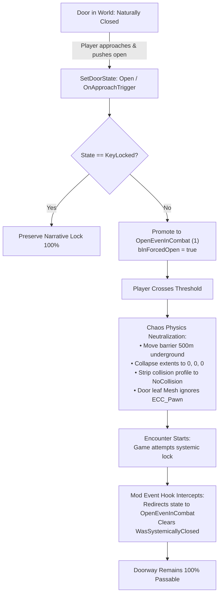

# Open Doors — The Blood of Dawnwalker Mod

[](https://store.steampowered.com/)
[](https://www.unrealengine.com/)
[](https://github.com/UE4SS-RE/RE-UE4SS)
[](https://github.com/)

> **Freedom to enter. Freedom to leave.**

**Open Doors** is an immersion and quality-of-life mod for *The Blood of Dawnwalker* (Rebel Wolves). It eliminates artificial combat door closures, self-locking gates, and invisible doorway threshold walls that trap the player inside combat encounter arenas.

---

## 🚪 The Problem

In the vanilla game, approaching and pushing open a door allows smooth entry into guard towers, bandit camps, and fortresses. However, the moment combat begins (such as the tower encounter in *"Rayko, the Incorruptible"*), the game:
1. Systemically slams the door shut behind you (`WasSystemicallyClosed = true`).
2. Forces the door into a locked state (`EDoorState::Locked`).
3. Spawns an invisible collision box (`InvisibleWallForCombat`) across the doorway threshold.

Even if you pushed the door open yourself and no guard bolted it shut, you are artificially sealed into an enclosed killbox with zero ability to step back outside.

---

## ✨ Features

- **Realistic World Doors**: Doors no longer magically slam shut and lock themselves. What you push open stays open.
- **Zero Invisible Walls**: Completely neutralizes combat barrier collision boxes (`InvisibleWallForCombat` & `LockedObstacle`) at the threshold.
- **Tactical Freedom to Disengage**: Scout ahead, assess enemy resistance, retreat back out into the courtyard, or fight from the doorway.
- **100% Quest & Narrative Lock Preservation**: Legitimate story doors locked with a key (`EDoorState::KeyLocked`) are strictly safeguarded and remain locked until the appropriate key is acquired.
- **Unvisited Doors Stay Closed**: Closed doors across the world remain in their natural state until you approach and push through them.
- **Zero Idle Overhead (0 CPU cycles)**: Purely reactive and event-driven. Zero background `Tick` polling, zero continuous distance scanners.
- **Crash-Proof Non-Destructive Design**: Never destroys game components, preventing null-pointer access violation crashes (`0xc0000005`).

---

## 🛠️ Requirements

- **The Blood of Dawnwalker** (Steam / PC)
- **UE4SS v3.0+** (Unreal Engine 4/5 Scripting System calibrated for *The Blood of Dawnwalker*)

---

## 📦 Installation

### Method A: Direct Extract (Recommended & Foolproof)
1. **Locate your game folder**:
   - In Steam: Right-click **The Blood of Dawnwalker** -> **Manage** -> **Browse local files**.
2. **Extract the ZIP**:
   - Extract the contents of `OpenDoors-v1.0.0.zip` directly into your game folder.
   - The files will automatically extract to:
     ```
     <GameRoot>/Dawnwalker/Binaries/Win64/ue4ss/Mods/OpenDoors/
     ├── scripts/
     │   └── main.lua
     ├── enabled.txt
     └── README_INSTALL.txt
     ```
3. **Done!** Because `enabled.txt` is included, UE4SS automatically enables and loads OpenDoors on game launch.

### Method B: Manual Installation
1. Install **UE4SS** (v3.0+) into `<GameRoot>/Dawnwalker/Binaries/Win64/ue4ss/`.
2. Copy the `OpenDoors` folder into `<GameRoot>/Dawnwalker/Binaries/Win64/ue4ss/Mods/`.
3. *(Optional)* If not using `enabled.txt`, open `ue4ss/Mods/mods.txt` in a text editor and add:
   ```text
   OpenDoors : 1
   ```
4. Launch the game and enjoy open doors!

### 🔍 How to Verify It's Working
1. Push open any door leading into an encounter (e.g. guard tower in *"Rayko, the Incorruptible"*).
2. When combat starts, the door will stay swung open, and you can freely walk or roll back outside through the threshold into the courtyard.
3. Check `<GameRoot>/Dawnwalker/Binaries/Win64/ue4ss/UE4SS.log` for:
   ```text
   [Lua] [OpenDoors] Mod loaded successfully (v1.0.0). Zero-polling Chaos physics neutralization active.
   ```

---

## 🎮 How It Works



### Architecture Highlights:
- **Resilient Engine Primitives**: Hooks high-level Unreal Engine reflection events (`/Script/DogwoodWorld.Door`) by symbolic name. Zero hardcoded memory addresses, zero brittle assembly patches (AOBs) that break when the game updates.
- **Active Chaos Physics Neutralization**: Uses native engine physics methods (`K2_SetRelativeLocation`, `SetBoxExtent`, `SetCollisionEnabled`, `SetCollisionResponseToAllChannels`) to ensure the physical collision body is completely evicted from the active Chaos physics scene.

---

## ⌨️ Controls & Diagnostics

- **Passive & Autonomous**: The mod requires zero manual interaction during normal gameplay.
- **F8 (Optional Diagnostic / Emergency Unlock)**: Pressing **F8** sweeps all active doors and barrier components across the active area, logs the nearest door's component state to `UE4SS.log`, and unlocks any non-quest doors.

---

## 📖 Technical Documentation

- **[GroundTruth.md](GroundTruth.md)**: Live architecture specifications, reverse-engineering findings, and engine hook definitions.
- **[Findings.md](Findings.md)**: In-depth technical breakdown of the door hierarchy, encounter lockout mechanics, and Chaos physics scene behavior.
- **[Changelog.md](Changelog.md)**: Full release history and iteration log.
- **[AGENTS.md](AGENTS.md)**: Guidelines for automated and AI-assisted development.

---

## ⚖️ License

Distributed under the MIT License. See `LICENSE` for details.
All game assets and engine code belong to Rebel Wolves Sp. z o.o.
